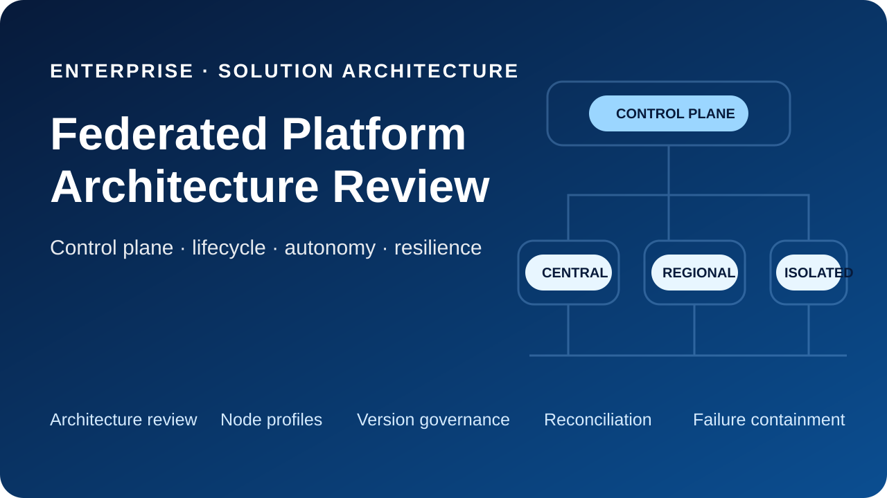
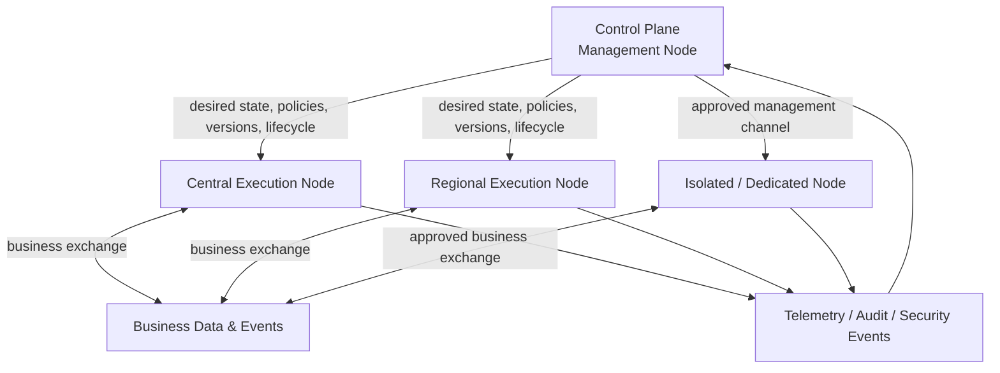
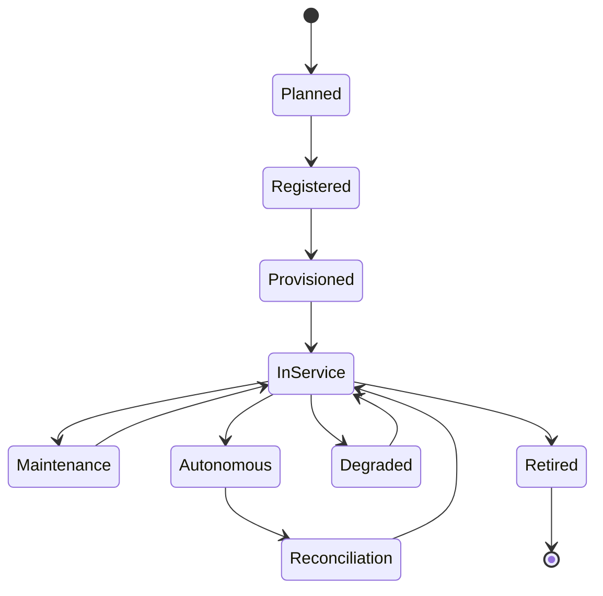

# Federated Platform Architecture Review

  

**Enterprise / Solution Architecture review case — distributed platform governance, control-plane separation and operational architecture**

This repository presents a synthetic public case study based on a real architecture-review pattern: a distributed enterprise platform was functionally well described, but the architecture did not yet define how a fleet of central, regional and isolated nodes would be governed, versioned, monitored, upgraded and operated as one platform.

The review reframed the problem from **"centralized settings"** to **"platform control plane"** and introduced an explicit separation between management, execution/data exchange, and observability/security concerns.

> **Role:** enterprise & solution architecture, architecture review, distributed-systems governance, platform operating model, lifecycle/version management, resilience and architecture communication.
>
> **Publication boundary:** all employer, customer, project, system, organizational and environment-specific information has been removed. The public case is newly authored and synthetic; original corporate documents, diagrams, names, identifiers and implementation details are not published.

## Case at a glance

### Initial architecture

The baseline concept already included several sound design ideas:

- a federated topology with central and regional nodes;
- independently deployable platform services;
- API-based and event-driven integration;
- centralized security policies and reference data;
- monitoring and audit;
- local storage/processing close to consumers.

However, federation was described mainly as a **functional topology**. The concept did not yet provide a complete operational model for managing multiple deployed nodes as one governed platform.

### Review finding

The key architecture gap was the absence of an explicit **control plane**.

A business/application administration module had accumulated responsibilities that belong to platform operations: node configuration, technical versioning, deployment state, monitoring and lifecycle management. This blurred boundaries between:

- business-level configuration of application behavior; and
- technical governance of distributed runtime nodes.

The review therefore proposed keeping application configuration focused on business rules while introducing a separate cross-cutting control plane.

## Architecture correction

The control plane is **not** the mandatory route for business traffic. A temporary loss of management connectivity must not automatically stop already-authorized local processing. Nodes continue using the last confirmed configuration within their allowed operating mode and reconcile after connectivity is restored.

## Main review findings

| ID | Finding | Architecture risk | Proposed correction |
|---|---|---|---|
| F-01 | No explicit control plane for the federated platform | node fleet becomes a set of separately administered installations | introduce a dedicated logical management node and platform control plane |
| F-02 | Business configuration and technical node management are mixed | unclear ownership, unsafe change boundaries, accidental coupling | keep business configuration in the application layer; move node/version/lifecycle governance to the control plane |
| F-03 | Node types are named but not defined as standard profiles | inconsistent regional deployments and configuration drift | define central, regional and isolated node profiles with mandatory/optional capabilities |
| F-04 | No governed lifecycle for nodes | upgrades and retirement become manual local procedures | define registration, provisioning, configuration, upgrade, rollback, service modes and decommissioning |
| F-05 | Autonomous behavior is implicit | platform behavior during network partitions is unpredictable | define normal, maintenance, degraded/emergency and autonomous modes |
| F-06 | Synchronization rules are incomplete | duplicates, divergent state and unsafe "last write wins" behavior | define authoritative sources, versioning, idempotency, replication direction and conflict-resolution rules |
| F-07 | Isolated environments are not first-class architecture objects | security exceptions create bespoke platform forks | introduce a standard dedicated-node profile for isolated or high-security segments |
| F-08 | Central and local operations responsibilities are unclear | incidents and changes cross organizational boundaries without ownership | explicitly define platform-owner vs local-operator responsibilities and escalation boundaries |
| F-09 | Control-plane availability is not separated from service availability | management outage can cascade into business outage | design control-plane resilience while preserving bounded execution autonomy |

## Target operating model

The corrected architecture treats every deployed node as a managed platform instance with an explicit profile and lifecycle.

A node is expected to provide, within its profile:

1. unique identity and trust establishment;
2. runtime for assigned platform services;
3. local application of approved policies and configuration;
4. integration endpoints;
5. buffering during temporary disconnection;
6. local collection of logs, metrics, audit and security events;
7. local content/metadata/index storage when required;
8. explicit separation of central and local administrative authority.

The management node maintains the node registry and topology, desired state, compatible versions, policy/configuration distribution, lifecycle state, compliance monitoring and audit consolidation.

## Node lifecycle

The review explicitly made lifecycle management part of the architecture rather than leaving it to deployment scripts or local operational procedures.

## Why this was an architecture issue

The main lesson is that **federation is not only a topology**. Once a platform is deployed across many locations or security zones, the architecture must define how those instances remain one platform over time.

That requires explicit answers for:

- desired vs actual state;
- version compatibility and rollout;
- configuration distribution;
- trust establishment;
- operating modes during partial connectivity;
- telemetry and audit;
- data authority and conflict resolution;
- central vs local responsibility;
- recovery after a partition or failed change.

Without these decisions, the target state can look distributed on a diagram while remaining operationally dependent on manual administration.

## Review approach

The review used a practical architecture lens developed through prior experience with distributed integration platforms: examine not only *what services exist*, but also *how the platform is governed, changed, observed and recovered after it has been deployed many times*.

The checklist is documented in [docs/review-method.md](docs/review-method.md).

## Repository contents

| Artifact | Purpose |
|---|---|
| [Case context](docs/case-context.md) | synthetic baseline and review scope |
| [Review method](docs/review-method.md) | reusable architecture-review checklist |
| [Findings](docs/review-findings.md) | problem statements, risks and recommendations |
| [Target architecture](docs/target-architecture.md) | control/execution/observability model and node profiles |
| [Decisions & trade-offs](docs/decisions-and-tradeoffs.md) | rationale and consequences |
| [Architecture review memo](examples/architecture-review-memo.md) | synthetic example of concise stakeholder communication |
| [Publication boundary](docs/anonymization.md) | sanitization rules used for this portfolio case |
| [Origin](ORIGIN.md) | authorship and source-boundary statement |

## Architecture storyline

## Outcome

The architecture review changed the platform description from a set of federated functional components into a **centrally governed distributed platform** with:

- an explicit control plane;
- standard node roles and profiles;
- controlled version/configuration rollout;
- defined operating modes and bounded autonomy;
- explicit synchronization and conflict semantics;
- centralized observability with local buffering;
- clear operations responsibility boundaries;
- resilience rules preventing management-plane outages from becoming automatic service outages.

The public case focuses on the reasoning and reusable architecture pattern rather than the original business domain or employer context.
