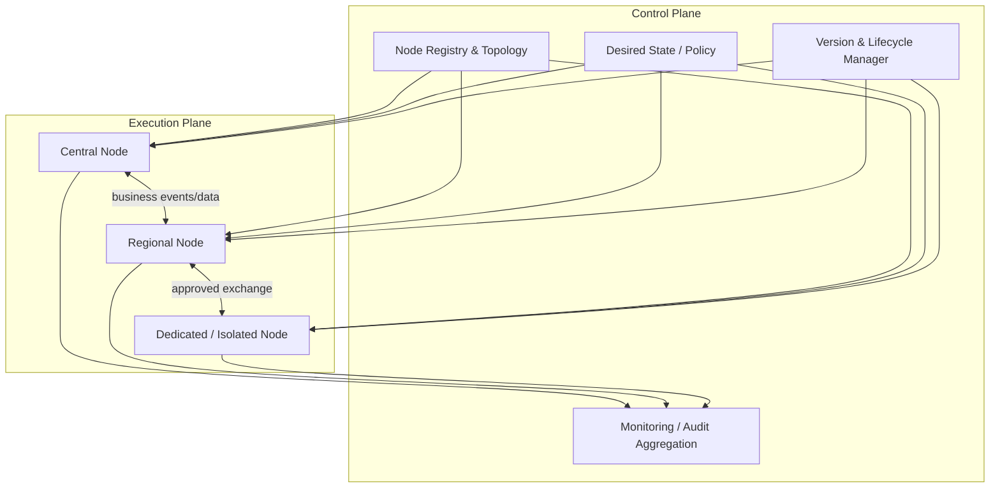

# Target architecture

## 1. Architecture planes

The corrected model separates three logical concerns.

### Control plane

Responsible for governing the distributed platform:

- node registry and topology;
- identity/trust bootstrap;
- desired technical state;
- configuration and policy distribution;
- platform-component version compatibility;
- rollout, rollback and lifecycle transitions;
- operating-mode control;
- compliance/drift detection;
- centralized audit and observability aggregation.

### Execution and data-exchange plane

Contains central, regional and dedicated nodes that execute platform functions and exchange business data/events.

The management node is not the mandatory route for business traffic.

### Observability and security plane

Carries metrics, logs, audit records, security events and configuration-compliance information. Each node collects and buffers locally; central consolidation resumes after connectivity is restored.

## 2. Logical architecture

## 3. Standard node profiles

### Central node

Typical responsibilities:

- shared platform services;
- central catalogs and cross-node services;
- coordination of processes requiring central authority;
- central archive or aggregation functions where required.

The central node is managed by the control plane on the same basis as other execution nodes.

### Regional node

Typical responsibilities:

- local processing and storage;
- reduced dependence on WAN connectivity;
- continuation of approved operations during temporary disconnection;
- local integration with regional systems.

### Dedicated / isolated node

Used when connectivity or security constraints prevent normal central/regional deployment.

Typical characteristics:

- only approved data categories;
- restricted exchange paths;
- possible delegated local administration;
- stronger locality/autonomy requirements;
- no independent product fork: it remains a governed platform profile.

## 4. Management-node responsibilities

The management node maintains:

- node identity and trust state;
- current and target versions;
- assigned profile and services;
- technical configuration/policy state;
- operating mode;
- rollout status;
- compliance/drift state;
- health and connectivity status;
- lifecycle history;
- audit of administrative actions.

## 5. Lifecycle

A minimum governed lifecycle is:

1. placement/profile planning;
2. node registration and trust establishment;
3. provisioning or connection;
4. initial configuration;
5. service/policy assignment;
6. health, capacity and compliance control;
7. staged update and compatibility validation;
8. rollback or recovery when required;
9. maintenance/degraded/autonomous mode transitions;
10. decommissioning and trust revocation.

## 6. Autonomous operation

During temporary loss of the control plane, a node:

- keeps the last confirmed configuration and policy set;
- continues only explicitly allowed local operations;
- buffers business messages when required;
- buffers telemetry and audit events;
- does not silently invent new policy or configuration state;
- performs controlled reconciliation after reconnecting.

Operations requiring current central authorization or cross-node consistency are delayed or constrained according to policy.

## 7. Synchronization and reconciliation

For each replicated data class, the architecture must define:

- authoritative owner/source;
- replication set and direction;
- version semantics;
- idempotency key or equivalent duplicate control;
- acknowledgement semantics;
- acceptable delay;
- conflict-resolution rule;
- recovery and replay behavior.

Conflict resolution should follow domain authority and lifecycle semantics rather than relying on unconditional last-write-wins behavior.
